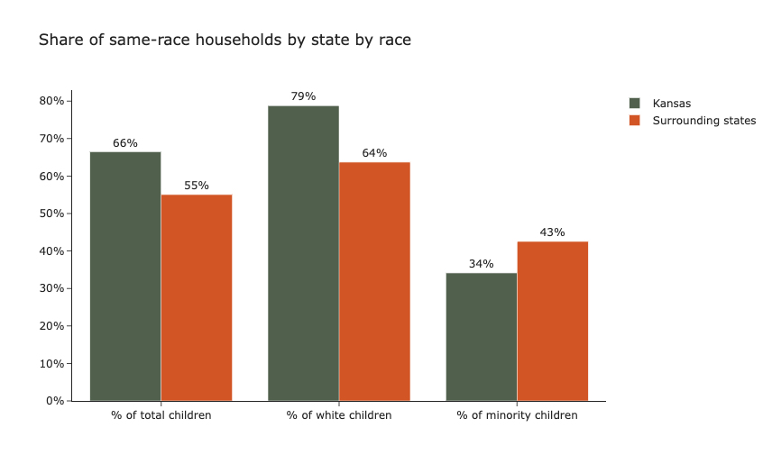

# FosterCareProject

## Introduction

In the United States, there are over 400,000 children in foster care on any given day, with over 200,000 children entering and exiting each year (US ACF, 2021). While many children are placed in group homes, relatives’ homes and other institutions, the largest share (45%) of children are placed in non-relative foster family homes (US ACF, 2021). With the average age of children in foster care being 8.4 years old, placement in non-relative foster family homes is a delicate task. Children in this age group have high developmental needs, and misplacement may result in short and long-term implications on the child’s mental health, emotional wellbeing, academic success and more (Leslie et. al, 2005). 

Despite the large number of cases and effort required to ensure that children are cared for and given the resources they need to succeed, the Child Welfare Departments across the country remain under-resourced and under-funded (Saxena et. al, 2020). In order to maximize their limited resources, some Child Welfare Departments have begun experimenting with algorithmic tools to assist social workers with decision-making, such as predicting risk of maltreatment, recommending placement settings and matching children with foster parents who are able to accommodate for their unique needs (Saxena et. al, 2020). While some tools have been commended by researchers for their improvements to child-outcomes and cost reductions, other analyses skepticize that the tools are biased, difficult to explain, or opaque (Saxena et. al, 2020; Church & Fairchild, 2019; Tushnet, 2018).

A wide range of tools have been deployed to facilitate decision-making and each employs different indicators in their models. Saxena et. al’s (2020) systematic review of research papers regarding algorithms in Child Welfare Services, found that child demographics were discussed in 40% of papers and only 4% of papers discussed foster-parent demographics. According to Mesa (2022), placement in a same-race household can provide foster children with a more familiar environment that leaves them less vulnerable to social isolation and emotional health struggles. As a result, children in mixed-race foster family homes may struggle to form their racial identity and feel connected to family members and members of the community. 

This analysis examines the inclusion of foster child and foster parent demographics into parent-child matching algorithms. In the first analysis, researchers will assess whether demographic variables in the Adoption and Foster Care Analysis and Reporting System 2015 (AFCARS) dataset are representative enough to undermine potential biases in parent-child matching tools if it were used as training data. In the second section, researchers examine whether the use of parent-child matching tools in Kansas resulted in a higher share of same-race placements compared to neighboring states.  

## Research questions
The subsequent sections attempts to answer the following questions: 
RQ1: Is there racial/socioeconomic overrepresentation among foster families? 
RQ2: Is AFCARS representative enough to be used as a training data set?
RQ3: Are states that use placement recommendation models or child-foster parent matching models more likely to take into account children’s wellbeing by placing them in same-race households?

## Literature review


## Methodology 
**Data cleaning** 
```python
# Limit columns to the ones that are necessary
foster_data_v2=foster_data_v1[['curplset','st',
'amiakn', 'asian', 'blkafram', 'hawaiipi', 'white', 
'hisorgin', 'untodetm', 'rf1amakn', 'rf1asian', 'rf1blkaa', 
'rf1nhopi', 'rf1white', 'hofcctk1', 'rf1utod','rf2amakn', 
'rf2asian', 'rf2blkaa', 'rf2nhopi', 'rf2white', 'hofcctk2', 
'rf2utod']]
     
```
```python
# Limit observations to those who live in a foster home, non-relative or pre-adoptive home
foster_data_v2= foster_data_v2.loc
[(foster_data_v2['curplset']== 'Foster home, non-relative') 
| (foster_data_v2['curplset'] == 'Pre-adoptive home')]
     
```

## Results

| head1        | head two          | three |
|:-------------|:------------------|:------|
| ok           | good swedish fish | nice  |
| out of stock | good and plenty   | nice  |
| ok           | good `oreos`      | hmm   |
| ok           | good `zoute` drop | yumm  |




## Limitations


## Discussion


## References
