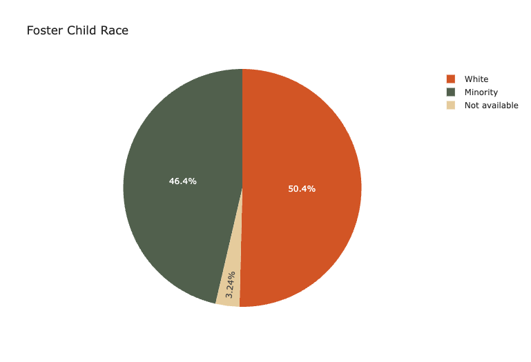
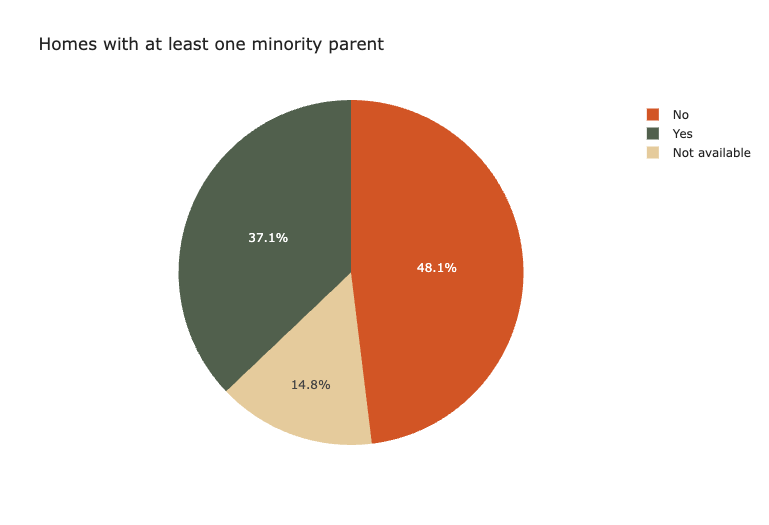
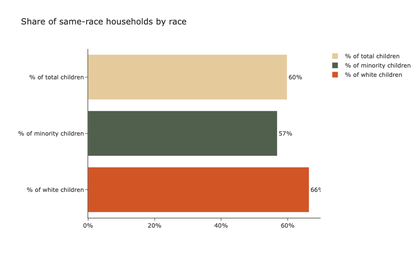

----

# Algorithmic matching in foster care: Help or harm?
----

*Research and analysis by Stavroula Chousou, Yasmine El-Ghazi, Ludovica Pavoni, Lea Roubinet & Morgan Williams*

*Decoding Biases in AI, SciencesPo, Fall 2022*

## Introduction

In the United States, there are over 400,000 children in foster care on any given day, with over 200,000 children entering and exiting each year (US ACF, 2021). While many children are placed in group homes, relatives’ homes and other institutions, the largest share (45%) of children are placed in non-relative foster family homes (US ACF, 2021). With the average age of children in foster care being 8.4 years old, placement in non-relative foster family homes is a delicate task. Children in this age group have high developmental needs, and misplacement may result in short and long-term implications on the child’s mental health, emotional wellbeing, academic success and more (Leslie et. al, 2005). 

Despite the large number of cases and effort required to ensure that children are cared for and given the resources they need to succeed, the Child Welfare Departments across the country remain under-resourced and under-funded (Saxena et. al, 2020). In order to maximize their limited resources, some Child Welfare Departments have begun experimenting with algorithmic tools to assist social workers with decision-making, such as predicting risk of maltreatment, recommending placement settings and matching children with foster parents who are able to accommodate for their unique needs (Saxena et. al, 2020). While some tools have been commended by researchers for their improvements to child-outcomes and cost reductions, other analyses skepticize that the tools are biased, difficult to explain, or opaque (Saxena et. al, 2020; Church & Fairchild, 2019; Tushnet, 2018).

A wide range of tools have been deployed to facilitate decision-making and each employs different indicators in their models. Saxena et. al’s (2020) systematic review of research papers regarding algorithms in Child Welfare Services, found that child demographics were discussed in 40% of papers and only 4% of papers discussed foster-parent demographics. According to Mesa (2022), placement in a same-race household can provide foster children with a more familiar environment that leaves them less vulnerable to social isolation and emotional health struggles. As a result, children in mixed-race foster family homes may struggle to form their racial identity and feel connected to family members and members of the community. 

This analysis examines the inclusion of foster child and foster parent demographics into parent-child matching algorithms. In the first analysis, researchers will assess whether demographic variables in the Adoption and Foster Care Analysis and Reporting System 2015 (AFCARS) dataset are representative enough to undermine potential biases in parent-child matching tools if it were used as training data. In the second section, researchers examine whether the use of parent-child matching tools in Kansas resulted in a higher share of same-race placements compared to neighboring states.  

## Research questions
The subsequent sections attempts to answer the following questions: 

RQ1: Is there racial/socioeconomic overrepresentation among foster families? 

RQ2: Is AFCARS representative enough to be used as a training data set?

RQ3: Are states that use placement recommendation models or child-foster parent matching models more likely to take into account children’s wellbeing by placing them in same-race households?

## Literature review


## Methodology 


In order to understand whether there is racial/socioeconomic overrepresentation among foster families and to examine the reality of foster care matching, the analysis employs the Adoption and Foster Care Analysis and Reporting System 2015 (AFCARS) dataset. Such data is compiled by the Department of Health and Human Services (HHS), the Administration for Children and Families (ACF), and Children’s Bureau (CB).

The dataset is exhaustive as it provides data on children who enter foster care, their entries and exits, placement details, and foster/adoptive parent information, which helped us identify adoption trends. The dataset of course also provides data on the social and racial background of the children in the foster care system, as well as racial information of caretakers, both 1st and 2nd foster caretakers.

The first step in our analysis was the process of data cleaning where we considerably resized the dataset, going from 104 variables to 23. The variables we decided to keep are of course all the variables that help explain the racial background of the children and of the caregivers as well as the variables that provide information about the current location of the children within the foster care system and the variable that provides information about the geographical location of the child. 

**Data cleaning** 
```python
# Limit columns to the ones that are necessary
foster_data_v2=foster_data_v1[['curplset','st',
'amiakn', 'asian', 'blkafram', 'hawaiipi', 'white', 
'hisorgin', 'untodetm', 'rf1amakn', 'rf1asian', 'rf1blkaa', 
'rf1nhopi', 'rf1white', 'hofcctk1', 'rf1utod','rf2amakn', 
'rf2asian', 'rf2blkaa', 'rf2nhopi', 'rf2white', 'hofcctk2', 
'rf2utod']]
```    
The second step was limit our observations in the variable curplset, to only the children who are currently in the foster, non-relative, and pre-adoptive homes. Once the data was sufficiently cleaned we were able to proceed with the analysis.

```python
# Limit observations to those who live in a foster home, non-relative or pre-adoptive home
foster_data_v2= foster_data_v2.loc
[(foster_data_v2['curplset']== 'Foster home, non-relative') 
| (foster_data_v2['curplset'] == 'Pre-adoptive home')]
     
```
…. (here if you want Lea you can add the gists of methodology for RQ1?, I couldnt find your collab and what you did but if you share it here I'd be more than happy to include it)

To answer our 3rd research question, we started by coding our data. We created a new dummy variable to distinguish between the children who fall into minority groups from those who do not fall into minority groups. Minority children are Black-African Americans, Asians, Hawaiians and Pacific Islanders, Indian American, and children of Hispanic origins that are encoded as 1. Non-minority children, the remaining white children therefore, are encoded as 0. We repeated the same procedure for 1st and 2nd foster parent, so we created a dummy variable that took value 1 if 1st parent was a minority and took value 0 if 1st parent was white. We created a second variable that also took value 1 if 2nd parent was a minority and value 0 if 2nd parent was white. These two variables were created in order to encode a third dummy variable that took value 1 if at least one parent is a minority and that took value 0 if 1st and 2nd parent are white.

To understand the share of same-race households by race, we combined the variables resulting in a variable that took value 0 when children and parents’ races matched (so when a minority child was placed with minority parents and when a non-minority child was placed with non-minority parents). It took value 1 when such matching did not occur.
….

For the last step in our analysis we compared the share of same-race households in Kansas, a state that used algorithmic matching in 2015, with two surrounding states with similar demographic compositions, Colorado and Nebraska. We chose Kansas as our benchmark state because Kansas was one of the first states to adopt a matching algorithm, implemented by the US Child Welfare System, and it was one of the first and only states to use a child assessment tool to determine the appropriate level of care each child requires. As early as 2010, two sub-state regions under contract with Kansas, began using a web-based decision support tool called "Every Child a Priority" (ECAP) developed by TFI Family Sercices to provide placement match options based on an algorithm that used information froma child assessment and information on available placement resources (Moore, Thomas & Cronbaugh-Auld, 2016).


## Results


### RQ1: Is there racial/socioeconomic overrepresentation among foster families? 

### RQ2: Is AFCARS representative enough to be used as a training data set?

### RQ3: Are states that use placement recommendation models or child-foster parent matching models more likely to take into account children’s wellbeing by placing them in same-race households?

Given evidence from the literature suggesting that same-race placement is an important indicator of childhood outcomes, we assessed the extent to which social workers with and without algorithmic aid place foster children in same-race households.  

```python
# Create dictionary for figure
dict_race = {0:"White", 1:"Minority", "NaN":"Not available"}
foster_data_v3['child_race_plot'] = foster_data_v3['child_race'].apply(lambda x : dict_race[x])

# Make figure
fig = px.pie(foster_data_v3, names='child_race_plot', title="Foster Child Race",
             color='child_race_plot',
             color_discrete_map={'White': '#BC8F8F',
                                 'Minority':'#B0C4DE',
                                 'Not available':'#778899'})

```



First, we will examine the demographic composition of minority vs. white non-relative foster families. In the dataset, around half of foster children placed in non-relative foster care are white, and the rest are minorities, indicating a relatively even demographic dispersion.

```python
# Create dictionary for figure
dict_race = {0:"No", 1:"Yes", "NaN":"Not available"}
foster_data_v3['parent_race_plot'] = foster_data_v3['atl1_parent_race'].apply(lambda x : dict_race[x])

# Make figure
fig = px.pie(foster_data_v3, names='parent_race_plot', title="Homes with at least one minority parent",
             color='parent_race_plot',
             color_discrete_map={'No': '#BC8F8F',
                                 'Yes':'#B0C4DE',
                                 'Not available':'#778899'})

fig.show()
```


With that said, there are more white non-relative foster families than homes with at least one minority parent. Since the dataset only includes matched families and does not have access to all foster parent applications, it is conceivable that there are more minority foster families on waiting lists and have not yet been matched with a foster child.

```python
# Create dataframe for bar graph
df_bar= pd.DataFrame(
    {"label":["% of total children", "% of minority children", "% of white children"],
     "value":[matching_percent[1],matching_minority[1],matching_white[1]]       
    }
 )

# Create bar chart
fig = px.bar(df_bar, y="label", x="value", orientation="h",
       color="label",
       text_auto=".0%",
        color_discrete_map={"% of total children":'#778899',
                            "% of minority children":'#B0C4DE',
                            "% of white children":'#BC8F8F'},
       labels={"label":'', "value":''},
       title="Share of same-race households by race")

fig.update_traces(textposition="outside")
fig.update_layout(xaxis=dict(tickformat=".0%"))
fig.show()

```



Using the American population of children placed in non-relative foster families in 2015, 60% are placed in same-race households. However, white children are 10 percentage points statistically significantly more likely to be placed in these households as compared to their minority peers.  

```python
# Create figure
fig = px.bar(df_bar2, x='label', y='value', color='state', barmode='group',
             text_auto=".0%",
        color_discrete_map={"Kansas":'#BC8F8F',
                            "Surrounding states":'#778899'},
       labels={"label":'', "value":'', 'state':''},
       title="Share of same-race households by state by race")

fig.update_traces(textposition="outside")
fig.update_layout(yaxis=dict(tickformat=".0%"))
fig.show()

```


As outlined in the methodology section, we compared the share of same-race households in Kansas, a state that used algorithmic matching in 2015, with two surrounding states with similar demographic compositions, Colorado and Nebraska. When examining the results in aggregate, it appears that foster children in Kansas, are 12 percentage points more likely than in surrounding states to be placed in same-race households. However, sub-group analysis uncovers a more confounding finding, that minority foster children in Kansas are 8 percentage points significantly less likely to be placed in same-race household, while white foster children in Kansas are significantly more likely to be placed in same-race households. 

On one hand, it is reassuring that a system using algorithmic matching is significantly more likely to place children in same-race households in aggregate. On the other hand, a system using algorithmic matching significantly diminishes the likelihood of a minority foster child being placed in a home that generates long-term positive outcomes. As minority foster children are a particularly vulnerable sub-population, the results suggest that algorithmic matching may  disproportionately disadvantage a group that is already systematically disadvantaged. Therefore, the algorithm may appear to developers and social workers that it improves outcomes for foster children, but in reality, it improves outcomes for white children at the expense of minority children. 

## Limitations

This study is only a primary introduction to the topic of algorithmic foster care matching, as more research should be done on the topic to gain an extensive understanding of its mechanisms. Indeed, in the US only very few states have adopted algorithmic matching; therefore, additional research should be carried out once more data is available. 

Going more in detail, the current analysis has some limitations data-wise as the dataset only has information for the 2015 year. This might impair our results as some placements in Kansas might have occurred before their implementation of algorithmic matching. Repeating the study with an updated dataset might lead to different results or might confirm our findings. Of course, repeating the research with updated data might also shed light on the progress that algorithmic foster matching might have had, it is possible that Kansas has adjusted its system so that more same race household placements have been observed. 

As far as data limitation goes, the present dataset does not have any information on LGBTQ couples, so no data for the sex/gender of the foster parents. Once again, expanding the scope of the research to this field would also yield some interesting results. One final potential limitation is that we grouped minorities into one group rather than matching each minority group for simplicity, but it can be justified because we would not have had enough data to find race specific matching. The data presented a significant number of non-assigned races to children and parents alike that would have skewed our results; moreover, considering that many 1st and 2nd foster parents do not have a same race it resulted difficult understanding under what criteria the matching would have been considered a same-race household matching. By having a more general approach we avoided incurring in such issue, but with more data it would be possible to increase this study’s specificity.

## Discussion


## Google notebooks
- RQ1 & RQ2: 

- RQ3: https://colab.research.google.com/drive/1h_fD9-K_Ys9AIHEGbXf0PGo_SuR1iAk0?usp=sharing

## References

